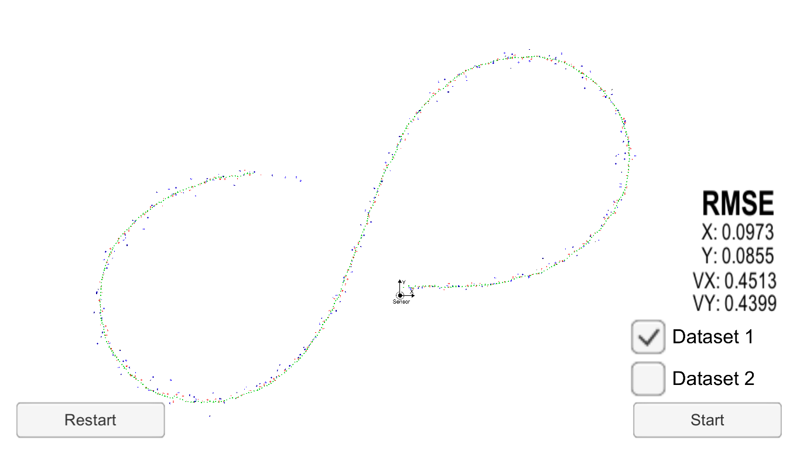

# Extended Kalman Filter Project Starter Code
Self-Driving Car Engineer Nanodegree Program

In this project I used a Kalman filter to estimate the state of a moving object of interest with noisy LIDAR and radar measurements. Passing the project required obtaining RMSE values within the intervals:

```
'         x    y    vx    vy
RMSE <= [.11, .11, 0.52, 0.52]
```

Using both LIDAR and radar measurements, the position error keeps confortably below the minimum required throughout most of the simulation. The velocity error starts higher and around halfway through, becomes lower than the allowed threshold. This makes sense since the velocity uncertainty is very high in the beginning because of the lack of LIDAR measurement for it and low RADAR resolution.


End of simulation with Dataset 1. LIDAR measurements marked with red, radar with blue and estimations with green.

When only LIDAR or radar measurements were used, the errors for both position and velocity were well above acceptance intervals. The fact the fusion of both sensors' data shows the virtue of using Kalman filters.
